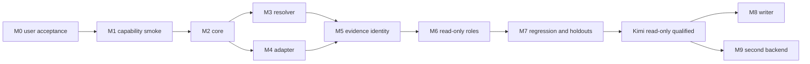

# Global External Subagent Implementation Plan

Date: 2026-09-19
Status: PROPOSED — implementation and live smoke wait for user acceptance.
Spec: [global-external-subagent-infrastructure.md](../specs/global-external-subagent-infrastructure.md)

## Execution Contract

Codex Astra owns final decisions、critical evidence verification、final diff、project-native acceptance。Research使用 `gpt-6-astra / ultra`；不主动降到 Sol/High。Native reviewer按当前明确要求与可用profile使用 `reviewer_max`（profile固定 `gpt-6-astra / max`，不是ultra；须如实报告）；模型 unavailable 不silent fallback。

本轮 M0 只产出 research/inventory/spec/plan。用户 acceptance 必须绑定具体文档版本；没有回答不等于接受。接受后在已提出的独立本地 repo 落地，不 push/release，不建立远程repo，不创建 dedicated worktree。

第一阶段产品目标覆盖 M1–M7 的 Kimi read-only qualification；M8 writer和M9 second-backend是后续有依赖的实现里程碑。不得把 M0 完成称为产品完成，也不得把 Kimi qualification 称为 provider-neutral abstraction 已跨 backend 验证。

## Reuse Decision

优先用当前 Python runner 的小型 builder/parser边界与 reviewed MIT tests，保留 attribution；不整包fork其workflow、permissions、fallback。先评估可直接抽取的小模块：若独立复用需要保留大量旧互斥状态和不安全process逻辑，则只复用接口/测试思路并实现薄边界，记录理由。不可将“新写”包装成已复用代码。

OS隔离优先使用现有 bubblewrap / pinned `anthropics/sandbox-runtime`，不自写安全内核；M1 必须验证该宿主可用性。是否加入 sandbox-runtime与HTTP库取决于其源码/许可审计和最小可运行探针，不预装依赖。其Linux实现仍依赖namespace，不能绕开本机bwrap失败事实。

## Milestones

| Milestone | Deliverable | Acceptance / stop condition |
| --- | --- | --- |
| M0 | 6项目源码research、host inventory、corpus清单、spec/plan | parent核验关键claims、native独立review、用户接受文档；当前里程碑 |
| M1 | M1a Kimi standalone route smoke；M1b containment qualification | M1a两profile各1次、受信CLI/空cwd/隔离config/无文档工具hooksMCP；验证wire model/thinking/effort/response identity。M1b单独验证OS权限和credential containment，控制project准入；缺credential只停在注入点 |
| M2 | provider-neutral invocation core | 小CLI/API、typed contracts、process group、双流排空、timeout/cancel、原子receipts；fake tests无provider |
| M3 | Project Contract Resolver | ancestor/nested rules、source hashes、explicit active refs、Skill ambiguity、Harness refs；AI-VIDEO与generic fixture都无special-case |
| M4 | Kimi Claude runtime adapter | isolated native projection、完整Skill assets、官方endpoint、alias/effort、tool deny、broker；fake/native conformance |
| M5 | Mechanical identity + receipt qualification | upstream observation与每次wire request绑定；错模型、缺identity、rewrite/fallback、secret负向test全部拒绝 |
| M6 | explorer/reviewer/test-investigator | read-only权限真实生效、nested delegation禁用、required evidence覆盖；sandbox不可用则不接项目源码 |
| M7 | MiniMax corpus replay + dual-project K3 holdouts | historical/synthetic provenance分离；8 matched live任务、parent原生复核、worker/deep对照、所有用户首阶段条件 |
| M8 | scoped implementer | 精确文件、candidate patch、preimage/hash、冲突检查、adversarial tests、parent apply/verify；不写现有dirty目标 |
| M9 | 第二个provider和不同native runtime | 推荐Gemini；独立adapter通过相同contract suite和两repo有界live验证；之后才能宣布跨backend abstraction验证 |

## Dependency And Feasibility Order



M1为standalone有界probe，需要最小observer/credential harness先验证关键不确定性；它不是提前完成M2–M5。Prototype只在独立tool repo的实验目录存在；M4/M5吸收后删除重复生产路径，保留fixture和evidence。不能在M1困难时先扩建framework来回避identity或credential blocker。

## M0 Current Evidence

- 八个指定/相关上游clone固定HEAD；六个主要候选源码审查，CodeRouter歧义与plugin也查明。
- 官方Kimi models/Claude integration核对，明确client alias、thinking替换行为和1M entitlement。
- 当前host CLI/Skill/MCP/credential presence盘点；未打印secret。
- 上游C focused tests 176 PASS；旧本机runner dialogue tests 28 PASS；两个数字都是既有实现的offline evidence。
- `bwrap` uid-map probe FAIL；RAG advisory query因`langchain_core`缺失失败；均保持记录，不伪造补证。
- 独立`reviewer_max`完成design review，修订后`accept with concerns`，无剩余blocking design issue；concerns是尚未验证的M1 runtime/identity/entitlement与M1b containment。用户acceptance待取得；新router代码与live provider调用均为0。

## M1 Contract

使用独立config/state，不运行官方文档中清理现有`~/.claude/settings.json`的脚本。已存在MiniMax配置继续保留。用户在官方Kimi console完成API Key创建/本地注入；只检测presence，不接收聊天中的key。

M1a先用fake upstream检验installed Claude 2.1.77的真实argv/env/setting precedence、native tools off、hooks/plugins/MCP off、wire model、thinking和effort。使用empty cwd与isolated config，验证未自动加载host/project instructions；无法保证则阻断probe。不用模型自述identity。升级Claude若必要，安装独立pinned版本，不能覆盖用户当前binary；记录版本/license与差异。

然后最小2次真实no-tools smoke：worker/high和deep/max。固定非敏感短输入、每profile一次；sealed wall/request预算，observer防止隐藏无限SDK retries。原生CLI无法给足身份evidence时，用薄observer采集upstream元数据；仍不足则`IDENTITY_UNVERIFIED`。M1a成功只记录route evidence，不能标记containment或project-access qualified。

M1b通过OS隔离、secret/file/IPC/network与native tool负向测试后，才能进入M6的项目数据准入。当前uid-map失败未解决时，M1b保持`BLOCKED_CAPABILITY`；允许继续独立的M2–M5 fake/local实现，不能运行项目live holdout或将prompt保护算作通过。M1a不产生凭据对恶意runtime隔离的证明；受信CLI假设和这一证据边界必须进receipt。

1M configured window、plan entitlement、实际消耗分开；无需为了证明model路由发送1M无用文本。entitlement未知阻止deep qualification，不自动替换worker或K2.8。

## M2–M5 Scope And Ownership

预计实现位置（以职责为边界，非要求逐文件机械创建）：

```text
src/agent_subagent_router/
  contracts.py          # invocation/report/receipt typed boundary
  supervisor.py         # finite execution and process facts
  receipts.py           # artifact binding and atomic finalization
  resolver/             # constitution/task sources and projection manifest
  adapters/claude.py    # native Claude execution/projection
  backends/kimi.py      # profile and endpoint policy
  transport/            # credential broker and upstream observations
  permissions/          # capability checks and sandbox integration
skills/external-subagent/SKILL.md
tests/{unit,contract,conformance,regression,holdout}/
```

Global core不引入AI-VIDEO runtime dependencies；其名称只允许出现在docs与holdout fixture/data。Contract resolution不执行project scripts。Parent Skill只调用CLI，不重复role/state-machine。

开始implementation时先固定每个slice的single owner、allowed paths、old path退场/隔离、unchanged contracts和focused verification command。主线程默认single writer；需要并行时只有文件集合不交叠才派bounded worker。不会为此创建worktree。

## Verification Matrix

| Area | Required executable evidence |
| --- | --- |
| Resolver | nested/祖先冲突、Git submodule、无Git显式root、duplicate Skill不同hash、stale refs、spec未accepted、预算不截断、source变更 |
| Projection | Claude native loader真实发现；scripts/assets字节与mode不丢失；CLAUDE/AGENTS不覆盖；未支持required hook拒绝 |
| Transport | stdin而非secret/prompt argv；stdout/stderr同时排空；大stderr不死锁；timeout/cancel清理整个process group；无terminal不能success |
| Identity | 请求kimi却response Claude/MiniMax/K2.8；CLI init正确但upstream错误；model rewrite；未知alias；thinking off；不同后台request |
| Credentials | sentinel不在prompt/receipt/log/argv；worker不能读secret store、HOME、proc/env、外部symlink；broker拒绝外域redirect与任意URL；cancel/timeout撤销capability；并发请求不能绕过原子预算 |
| Permissions | reviewer写文件失败；explorer Bash/Task/Agent/MCP失败；parent test domain无broker/网络/runtime proc/env/FD；exact test command不能变成shell组合；sandbox unavailable不能soft-pass |
| Receipts | missing/duplicate/truncated JSONL、hash不匹配、artifact路径穿越、并发receipt串线、终止恢复不补造成功、redaction provenance |
| Legacy corpus | MM-01…MM-10；representation vs contradiction分别断言；historical receipt不升级PASS |
| Writer | dirty baseline二次修改可检测、并发preimage变化拒绝、owned-only patch、无自动commit/revert、symlink/rename/delete边界 |
| Portability | generic fixture无项目manifest可运行；jizhang无AI-VIDEO coupling；M9不同runtime执行相同contract |

计划中的精确test entrypoints为独立repo提供的命令，待实施时创建；**以下尚未执行**：

```sh
python -m pytest -q tests/unit tests/contract tests/regression
python -m pytest -q tests/conformance --runtime claude-code --offline
python -m pytest -q tests/holdout --backend kimi --receipt-set <sealed-run-set>
python -m ruff check src tests
```

Live calls不隐含在默认pytest中；holdout command只验证sealed receipts，执行live需显式run-set命令与预算。Smoke/conformance独立于业务test，不能把fake stdout当live provider receipt。严肃状态/协议/权限修改采用red-green TDD；纯文档用链接/manifest/一致性检查。

## M7 Experiment Design

Parent先冻结两repo的selected源文件bytes和任务rubric，防止边测边改标准。AI-VIDEO working tree大量dirty，仅只读selected snapshots；jizhang包含.env backups和财务data，严格排除。

| Project | Task A | Task B | Parent native verification |
| --- | --- | --- | --- |
| AI-VIDEO | 有界service/schema/writer/validator owner mapping，挑战“可原样复用” | 阅读一个既有测试/incident，给出evidence和不能推断的结论 | current canonical contract、exact source、适用Harness inspection/readonly checks；不调用media Providers |
| jizhang | 充值/押金transfer规则mapping和tests对应 | fake adapter transfer分类review或已有test failure解释 | scoped源码检查；`npm --workspace server test`、`npm run lint`，仅fake路径 |

每任务worker/deep各1次，8初始任务；两次standalone smoke合计10；最多2个有明确原因的correction follow-up，总12。所有额外calls明确new attempt，不default retries。若某条件无法满足，记录BLOCKED，不用扩大次数换通过。

唯一usability判断由parent按sealed rubric完成；记录verified claims/unsupported claims、阻断questions、scope/Harness违规、required evidence、实际验证时间。比较样本很小，结论仅限这4个任务与版本，不作provider-wide统计优劣结论。

## M8 Writer Boundary

先在合成小repo做安全/rollback测试，再做普通项目的明确授权小patch；AI-VIDEO第一轮只读，不用它做writer试验。Scoped writer feature的启用依赖read-only合格、OS containment、live ownership检查和parent-controlled application。

普通项目有dirty目标时按用户规则先询问ownership；不能自行改掉其他工作。`git status`只是辅助，source baseline是exact bytes；不copy用户secrets到candidate。Implementer读取immutable baseline加owned candidate overlay，parent重新封存最终candidate并针对它运行tests；apply前检查preimage，apply后核对实际bytes和项目原生gates，不能只测baseline或用candidate通过替代最终验证。工作流清理只处理本轮candidate，不能自动`git reset`。

## M9 Second Backend

优先Gemini原生CLI；它能验证非Anthropic wire协议、不同instructions/skills/tools/identity/permissions。当前未安装，未授权任何账号登录动作；安装与有限live预算必须在M9执行前作为accepted scope明确。需用户凭据时提供官方本地登录动作，不能索要key。

Grok作为备选，但必须先明确官方/社区CLI发行包、身份观测和sandbox能力；GLM适合验证第二provider但仍共用Claude runtime，不能单独证明native runtime portability。

## Installation, Checkpoint And Rollback

在独立local repo中commit task-owned source/docs/tests；准确stage路径，不`git add .`。安装提供plan/diff、source hash、managed output hash，不覆盖unmanaged文件。Parent-facing Skill和CLI单一owner，project默认零写入。

安装完成后verify调用路径/版本与对应commit一致，旧runner仍可独立使用但不被新route自动选择。Rollback只有受管入口；source/receipts保留。No push, no release, no remote repository。

## Completion Report Contract

最终产品交付需提供research/spec/plan/diagram、实际复用与拒绝的OSS、安装global/project files、Kimi profile、两smoke receipts、corpus replay、两repo holdouts、exact tests、worker/deep结果、failures、remaining risks与M9建议。未做的项必须`NOT_EVALUATED`，不以文档、schema或exit0替代。

当前自然停止点是**可评审M0文档交付后等待用户acceptance**。这是用户明确要求，不是skill自行增加的approval gate。
