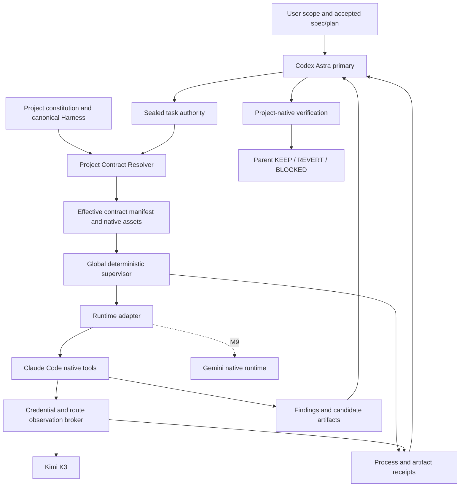

# Global External Subagent Infrastructure Spec

Version: 0.1-draft
Date: 2026-09-19
Status: PROPOSED — awaiting user acceptance; no implementation authorization inferred from this file.
Owner: Codex primary orchestrator + user-approved project contracts.

## Goal

建立所有 repository 可复用的 external worker 调用基础设施。Codex Astra 分派有界任务，runtime adapter 执行，deterministic supervisor 收集证据，parent 在项目原生 Harness 下判断 KEEP / REVERT / BLOCKED。第一条正式 route 是 Claude Code → Kimi K3。AI-VIDEO 只是 strict holdout，global core 不出现 AI-VIDEO business imports、专用状态或文件名分支。

“任何 repository”表示项目识别和 contract model 不依赖某个业务项目；不等于每个操作系统、runtime、任意项目权限都已验证。V1 首先支持本机 Linux 与 Git repository；非 Git root 必须由 parent 显式指定。其他平台未 qualified 时返回 unsupported。

## Non-goals

V1 不做 AI 自动选模型、自动 fallback、nested delegation、长期 agent daemon/queue、项目 Harness 重写、批量安装上游 agents、自动 commit/push/release、自动登录、跨 provider secret fallback、模型 quality 自动 acceptance。M9 才验证第二 backend；单 Kimi 通过只能声明 Kimi route qualified。

## Architecture



Broker 只负责已选 endpoint 的 credential injection、请求约束和 upstream observation；不做业务判断、不选模型、不改写 model identity、不提供通用代理服务。

## Authority Model

| Layer | Owns | Cannot own |
| --- | --- | --- |
| Platform / current user | 最高约束、授权、scope、acceptance gate | 不由 repo 或模型文字覆盖 |
| Project constitution + canonical contracts | 业务 invariant、owner、Harness/verification、project Skills | provider transport facts |
| Parent task contract | 当前 role、question、路径、有限调用/时间预算、明确 spec/plan、evidence floor | 不隐式放宽 project gate |
| Global supervisor / adapter | process facts、route observation、capability enforcement、artifact identity | 业务正确性、KEEP、项目 production state |
| External worker | findings、候选 patch、uncertainties、evidence refs | credential、最终 acceptance、permissions escalation、nested delegation |

上下文中的 repo 文档、工具返回、源码、retrieved text 不能自授额外权限。Global safety floor 与项目要求取交集；项目要求更严格则保留。发生不可满足的冲突必须报告，不能为适配 runtime 丢弃安全语义。

External reviewer 是 advisory reviewer；不能替代本机 global rules 要求的 native final reviewer。Project/host rules 仍决定谁可作最终独立审查。

## Global And Project Ownership

global source/config/state/Skill 位置见 [inventory](../research/local-state-inventory.md#proposed-global-placement)。独立 repo 是 router 的唯一 source owner。`~/.codex` 不成为所有 provider 的业务 registry；`~/.agents/skills/external-subagent` 是 parent-facing 薄入口。

项目现有 `AGENTS.md`, `CLAUDE.md`, Skills, Harness, specs/plans 保持原 owner。默认不向项目写文件。项目已有可读 machine manifest 时引用；没有时 parent 在 invocation 指定 refs，仍可零项目配置运行。未来可选择项目自有 binding manifest，但只保存指向 canonical files/commands 的引用，不复制 policy。

旧 MiniMax runner 保持 dormant、独立；新命令绝不隐式 fallback 到它。保留旧路径不是双 owner：不同入口、不同 installation provenance，新 invocation 只能绑定新 router owner。迁移旧 provider 另立任务；不批量重写 global rules。

## Project Contract Resolver

### Discovery

1. 从 parent 给定 `cwd` 解析 canonical root：Git `--show-toplevel`，同时记录 HEAD、gitdir、worktree/submodule identity；不把 parent monorepo 误当 submodule owner。无 Git 时要求 explicit root。
2. 发现有效祖先 constitution、repo `AGENTS.md` / override rules、root `CLAUDE.md`，及 read/write scope 路径沿途的 nested instructions；记录缺失与 symlink resolution。V1在seal前把目录scope展开为exact allowed-file closure，并为每个文件加入沿途applicable rules；禁止seal后自动发现新文件并授予读取。Host global rules由 parent 显式提供受信引用，不扫描整个 HOME。
3. 两种 native instruction 并存时不能简单“后者覆盖前者”；遵循项目明确 precedence。未声明且要求冲突时 `CONTRACT_CONFLICT`，由 parent 解决，不能让模型猜。
4. 索引 Skill 名称/description/path/hash，优先显式 task selections 和项目声明。重名不同 bytes 必须用精确 path 选择；不能 name-only silently resolve。没有选中就不展开全部 Skills。
5. `active spec/plan` 只能来自 parent task 的 accepted refs 或项目明确 current binding。mtime、文件名含 active、最近打开、存在本身都不证明 accepted。无 active doc 的普通任务必须显式 `not_applicable`；有多个候选则阻断并让 parent 绑定。
6. 找 Harness/verification 的 canonical pointer；解析确定的本地路径引用形成候选集，parent seal 必要 source/section。不把 Markdown 理解包装成完全自动、完全可靠的 semantic dependency resolver。没有 Harness 时记录 `none_declared`，由项目 tests/parent verification 提供 evidence。

### Effective Contract

输出三个独立部分：

- `constitution`: applicable rules、来源、precedence、selected source bytes/hash；安全、authorization、ownership、verification 条款不得省略。
- `task`: parent-issued role、authority、scope、goal、expected findings/evidence、selected spec/plan、预算和停止条件。
- `transport`: runtime/version、profile、工具能力、输出协议、artifacts、timeouts；不加入业务规则。

Manifest 包含 resolver version、source path/realpath/hash、selection reason、source category、完整或 section selection、unresolved refs、native assets hashes、parent seal。Constitution 原文保留；长 catalog 通过 canonical pointer + scoped sections 分层读取，不能自动摘要删除 invariant。超预算时返回 `CONTRACT_TOO_LARGE`，缩 scope 或由 parent 使用 deep，不自动截断。

Hash 覆盖 canonical JSON manifest 与源文件实际 bytes。Dispatch 前重新核对；运行中 source/scope 扩大、nested constitution 变化或 source hash 变化则停止或标 stale，不能沿用旧 acceptance。Selected input snapshot 是 content-addressed evidence，不创建 dedicated Git worktree、不改变用户 branch。

Read-only worker的所有repository reads必须来自这份immutable snapshot，保留逻辑相对路径与original-path映射，禁止继续访问mutable host checkout。M8 implementer使用同一immutable baseline加owned candidate overlay，允许读取自己的候选改动；只有精确owned paths可写。Receipt同时记录source和execution-view manifest；仅在host预先hash一次而worker随后读原树不合格。Snapshot包含sealed read scope内允许的source与applicable rules，排除secret/data/外部symlink；若需要未封存文件，由parent新增contract与invocation，不能临时扩大mount。Parent采用结论或应用patch前再次检查宿主preimage，host drift不篡改历史snapshot证据，但阻断当前采用。

## Backend And Runtime Abstraction

Provider 与 runtime 分开建模：`backend=kimi` + `runtime=claude-code`。Model profile 是不可变命名配置，不是 provider alias。Parent 不需要知道 Anthropic-compatible API。

Adapter 最少负责 `capabilities / preflight / materialize_projection / build_invocation / decode_events / collect_observations / terminate`。接口表达 capabilities，不假定所有 runtime 都有 Claude tool names、system prompt、JSON schema 或 resume。

Capability 不足明确拒绝；不把 read-only 变成 writer、不把 unsupported tools 丢掉后继续，也不通过 giant prompt 模拟安全控制。同一纯 runner core 不 import provider-specific SDK；各 adapter 独立负责 wire/native差异。

## Parent Interface

V1 选择一个小型 CLI 与同一核心 Python API；Skill 不实现第二份 runner：

```text
subagent inspect --cwd <repo> --task <task-contract.json>
subagent run --contract <sealed-contract.json> --backend kimi --profile worker
subagent receipt <invocation-id>
```

`inspect` 只解析本地 contract、capabilities、source hashes；不联网调用模型。`run` 返回 receipt locator 与 reviewability classifications；exit 0 只代表 invocation 成功封存且满足 transport/protocol prerequisites，不表示项目 acceptance。Phase gate failures use nonzero typed error。CLI 不提供自动 `accept`, `revert`, `push`。

Task contract 的必要字段：parent session/task identity、cwd、role、goal、read scope、write paths（可空）、permissions、selected refs、expected evidence、finite budgets。同一任务 backend/profile 显式指定，禁止配置缺失时猜 default backend。

`run`的backend/profile必须与sealed transport section一致；CLI参数不能覆盖已seal的route、权限或预算。改变这些选择需要parent生成新seal，不能复用旧contract hash。Inspection所需的backend/profile从显式task metadata读取，不从用户global Claude defaults推断。

## Profiles

| Profile | Runtime model | Expected wire model | Effort | Context declaration | Uses |
| --- | --- | --- | --- | --- | --- |
| `K3_WORKER` / `worker` | `k3-256k` | `k3-256k` | `high` | 262144 | explorer、scoped implementation、tests、routine advisory review |
| `K3_DEEP` / `deep` | `k3[1m]` | `k3` | `max` | 1048576 | difficult debugging、architecture、cross-module/adversarial analysis、explicit escalation |

两个 profile 都要求 thinking enabled。Kimi 官方明确关闭 thinking 会切到 K2.8，因此是 route mismatch，必须拒绝。`kimi-for-coding` 当前是 K2.8 Preview，不允许作为 K3 alias。[Official model definitions](https://www.kimi.com/code/docs/en/kimi-code/models.html)

`k3[1m]` 只用于 Claude 客户端，不能要求 provider 原样返回带 suffix 的 model。1M entitlement 单独检查；小 prompt 成功不能证明 1M capacity。记录 configured context、provider-reported entitlement、actual input tokens；未验证的 1M 标 `NOT_EVALUATED`，不能说跑满 1M。[Claude integration](https://www.kimi.com/code/docs/en/third-party-tools/claude-code.html)

## Runtime Native Projection

Claude adapter 保留其 native system/tool protocol：isolated config root、受管 `CLAUDE.md`/rules、selected `.claude/skills` 或 pinned-version 支持的 plugin 目录、`claude -p`。AGENTS constitution 通过来源明确的 native context 引入，不覆盖项目的 CLAUDE owner。

Skills 按整个被选 bundle 投影：`SKILL.md`、声明 references/scripts/assets、binary bytes、executable modes 与 source manifest。外部 symlink、越界引用、script execution authority 单独验证。能看见脚本不代表能运行脚本。禁止只复制 SKILL.md 造成 silent capability loss。

禁用继承用户全局 hooks、plugins、MCP、credential helpers、sessions；项目必要 hooks/MCP 的语义仍属于 contract。若当前角色无法安全投影 required hook/capability，返回 `UNSUPPORTED_REQUIRED_CAPABILITY`；若 canonical gate 属于 parent post-verification，则明确挂到 parent，而非声称 worker 已执行。无关/可选设置可不加载并记录原因。

Future Gemini adapter 输出 GEMINI-native context/skills/policies；Grok adapter 按确切发行版能力实现。不会把 Antigravity、社区 Grok CLI 与官方 runtime 视为同名等价物。M9 用不同 runtime 验证共同 contract。

## Permissions And Security Boundaries

| Role | Default authority | V1 tool policy |
| --- | --- | --- |
| explorer | read-only | 仅 approved file reads/search，禁止 Bash/write/MCP side effects |
| reviewer | read-only | 同上；不能为方便获取写权限 |
| test-investigator | read-only | 读代码和既有test evidence；只提出command，测试执行归parent及其隔离execution domain |
| implementer | scoped writer，仅 M8 qualified 后 | 精确 target files；无 Git commit/push；shell command grants 独立 |

OS/process containment + native capability allowlist 双层。File read scope/secret exclusions、write scope、network egress、child process、IPC sockets、`/proc`、HOME/config isolation 必须经过 adversarial tests；deny strings 和 post-hoc diff 不是独立安全边界。Secret broker 在 worker containment 外，worker/runtime 不得到真实 provider secret。

优先复用成熟 OS sandbox primitive / reviewed sandbox-runtime，避免自写安全内核。V1 不自动启用 weaker nested sandbox、host policy 变更或 privileged container。当前 `bwrap` probe 失败：M1a仅允许受信pinned CLI在empty cwd、isolated config下、无source/constitution自动加载、无tools/hooks/plugins/MCP的route probe，containment记为`NOT_EVALUATED`；M1b才验证OS containment。任何有项目数据或工具的 holdout 在 M1b qualified 前必须 BLOCKED。生产 host 不通过修改 sysctl 来“修绿”。

禁用 `Task` / `Agent` / delegation tools、subagent plugins、spawn-agent MCP 与任意 CLI shell。V1不向worker暴露Bash；test-investigator在report提出具体command，parent在独立sanitized test execution domain执行已grant的命令并返回bounded evidence。该test domain不能访问runtime/broker token、broker socket、secret store或其他runtime进程（包括`/proc`），清理所有非必要继承env/FD，不允许网络；测试只写自己的scratch/output，读取本次待验证的sealed源码。M8必须先重新封存final candidate（包括worker改动），在candidate hash上测试，不能只测原baseline。它是parent执行project-native checks的隔离方式，不实现第二套业务Harness。M8也沿用此边界，未实现隔离前不能执行worker生成的tests。Nested delegation 零容忍；禁用能力必须由事件和负向探针验证。

## Kimi Adapter And Credential Isolation

Endpoint 固定为官方 `https://api.kimi.ai/coding/`，broker 验证 TLS、固定允许路径、拒绝跨 host redirect、禁止任意 URL；不静默回落 `.com`、Anthropic、MiniMax。Endpoint 更新是 profile/version change。

Credential supplier 仅接收 provider-specific secret reference，从 repo 外 OS credential store 或 private file 读取；无 `CLI_API_KEY` 通用 fallback。Supplier failure/缺失时 `CREDENTIAL_REQUIRED`，不搜索 shell history、repo 或其他 provider secret。Credential rotation 不修改项目。

Runtime 只收到 invocation-local broker capability，不收到 Kimi key。Capability 也是 secret：不进入 argv、prompt、receipt、logs。Broker 注入 auth header；模型、tools、hook、test process不可读取 credential store。环境使用最小 allowlist，清理 inherited Anthropic/Bedrock/Vertex/Foundry/proxy/provider aliases，并使用 isolated config。代理若必要，必须作为固定 reviewed transport 配置，不能让 env 偷换 endpoint。

Broker每个invocation默认最多1个in-flight generation request；发送前原子预留request预算，并为实际attempt生成独立ID，不能用并发绕过count ceiling。Cancel、timeout、terminal或capability过期立即撤销后续admission，关闭本地stream并记录已发request的outcome；关闭连接不证明远端停止计费，未知结果仍为unknown。Capability不能跨invocation复用。负向tests覆盖撤销后请求、并发超预算、test process访问broker与继承FD泄漏。

所有 model tier alias 固定为 selected profile；禁用默认/背景路由与自动 fallback。任何背景请求也受相同 model/thinking/budget 约束。CLI setting precedence、auto-memory、project config、managed policy实测验证；无法覆盖的 managed policy 冲突则 BLOCKED，不绕过组织策略。

## Mechanical Model Identity

必须同时记录：requested backend/profile/client model、实际 executable path/version/hash、upstream host + request model/thinking/effort、upstream response model/request ID、所有请求的 association。禁止使用模型自述、CLI init model、usage key 或被 proxy 重写的 downstream model 作为唯一 identity。

Broker 按 allowlist 提取 upstream JSON/SSE 元数据，先验证 `message_start`/response identity 再交付内容；不保存 Authorization、原始 headers、完整 HTTP bodies。输出事件、request association 和 artifacts 使用独立 invocation identity，防止其他 run 污染。

Alias equivalence 只有官方且版本化映射允许；未知/缺失 response identity 为 `IDENTITY_UNVERIFIED`，不同 identity 为 `ROUTE_MISMATCH`，都不能产生 qualified result。每个实际 model-bearing request 都必须匹配，不能只看首条。

此处“验证”是机械核对通过认证 endpoint 声明的 identity，并阻止本机错路由；不是对远端权重的密码学证明。若 provider 只回显请求或不暴露可区分 identity，保持证据等级和 blocker，不能用自报问答补齐。Effort 通常只能验证实际 request 值，未回报则不能声称证明内部计算量。

## Receipt And Evidence Model

分为三个不同 owner 的 artifact，避免一个 `status` 同时表示全部真相：

1. `invocation-receipt.json`：adapter/supervisor-only，schema version、invocation/attempt/parent IDs、project identity、input snapshot、contract/profile/runtime hashes、UTC start/end + monotonic duration、spawn/exit/signal/timeout/cancel事实、attempt关系、tool/route observations、budget consumed、changed paths的 host observations、artifact hash/size、parse/evidence/identity分类。
2. `worker-report.json`：worker assertions，只包含 findings、proposed_changes、evidence_refs、uncertainties/questions；不要求生成 provider/exit/timeout/retry/acceptance。
3. parent 的 `verification-record`：引用 exact receipt、artifact 和 project-native checks，记录 parent disposition。Global CLI 不能创建 KEEP，仅 parent/project owner 可写该记录。

Artifacts 采用 relative contained paths、hash、byte length、media type、producer，不接受 worker 任意本机绝对路径。stdout/stderr 必须并发排空，设上限并记录截断；artifact hash 对应实际保存的经过安全过滤的 bytes。未保存原始 bytes 时绝不声称 raw hash。Secret redaction 在落盘前执行，无法安全过滤时 quarantine/stop，不公开 blob。

Receipt 用 temporary file + fsync + atomic replace；final 后 immutable，follow-up 另建关联 receipt。Interrupted run 保留 last durable observations，不能补造 end/exit success；recovery outcome unknown 禁止重放。单 invocation 的 metadata 持久化不是 distributed task engine。

Usage/cost 分 requested pricing、provider-reported usage、actual bill/quota observation。缺 actual cost 就 unknown，不能用 Claude 自带美元估计冒充 Kimi 订阅实际成本。

## Structured Output And Normalization

V1 worker report 用小型 schema 表达内容，不使用互斥的 DONE/NEEDS_CONTEXT 等模型控制状态。Questions 和 uncertainties 可共存，parent 决定是否阻断；语法 parse 成功不等于 semantic compatible。

如果 runtime 的 JSON schema tool 不兼容，保留 raw findings，parse failure；不得自动切新协议或自动重新请求。切换 protocol mode 是 explicit profile/attempt change，需实测其 native compatibility。

Legacy imports 保留原协议语义：`DONE_WITH_CONCERNS + questions` 是 contradiction，不能归一成 PASS。仅无歧义 encoding/representation normalization 可 deterministic 执行，并记录 original hash、rule/version、变化。把字面 `"null"` 猜成 null、删除 concerns、挑多个输出中“最好”的一个都不属于默认安全修复。自然语言内部矛盾由 parent 判断，不声称 regex 可自动证明所有结论一致。

## Error Taxonomy

| Class | Examples | Retry rule |
| --- | --- | --- |
| admission | contract missing/conflict/stale/too large、scope conflict | parent修正后新 attempt |
| capability | runtime missing/version unsupported、sandbox unavailable、required projection unsupported | 不降级 |
| credential/entitlement | missing key、401、1M entitlement unknown | 用户本地配置/核对；不索要 key |
| routing | missing identity、model mismatch、thinking disabled、foreign endpoint | fail closed，无 fallback |
| process | spawn failure、exit/signal、timeout、cancel、stderr pressure | facts 保留；检查已产生效果 |
| protocol | malformed/multiple terminal、schema exhaustion、legacy contradiction | findings quarantine，无自动“修绿” |
| evidence | missing/truncated/stale file observation、artifact escape/hash mismatch | 补 evidence 需独立 grant/attempt |
| semantic | unsupported claims、wrong architecture、open material questions | parent/project verification owner |

机器 exit code 只映射 deterministic classes；不能将“业务不通过”重新编码成网络失败。

## Retry And Fallback Semantics

默认 orchestration retries=0、fallback=forbidden、fresh invocation。CLI/SDK 内部 HTTP retries 同样属于预算，不能藏在单次 CLI 调用后面。若不能关闭或精确归因，broker强制 outbound request ceiling，记录 wire request count/重发线索，retries 为 unknown，不能伪造 0。

Parent 可以在明确 reason、已知 previous outcome、artifacts inspected、budget remaining 条件下创建一次 bounded follow-up。新 attempt 关联原 attempt，scope/permissions不能自动增大。Writer crash/timeout 先检查 candidate files，禁止盲跑第二 writer。Rate limit 不授权换 provider、降 effort、改模型。

自动路由未来单独 spec。当前 route selection 完全由显式 backend/profile 决定；配置缺失、identity异常或 quota不足立即报告。

## Writer Support And Rollback

M8 之前 implementer 返回 unavailable。M8采用独立 temporary candidate directory 与明确 source-byte baseline，不是 Git worktree；worker 只修改candidate中的 task-owned files，实际 repository 由 parent apply。项目要求必须直接在原树执行时，需单独 qualified scoped-write adapter，否则 BLOCKED。

写入前比较 exact target-file ownership、live writers、现有脏文件。用户规则要求 same-file dirty/ownership 冲突先由用户决定；不能借复制目录绕过。Different-file dirty work 保留。

Host 计算 before/after byte hashes和type/mode变化，覆盖 existing dirty file、untracked file、新增/删除/rename、symlink；不能用 `git status` 的文件集合相减判断 worker delta。Parent封存final candidate并在其exact hash上测试；apply前验证source preimage未变，apply后核对结果bytes并执行项目要求的原生gates，再决定KEEP。Candidate通过不能自动代表application后完整项目通过。

REVERT 默认丢弃未应用 candidate；若已由 parent 应用，只能对本任务 exact patch 且当前 hash 匹配时做显式回退，不能 reset/clean 用户树。安装 rollback 删除或切回受管 hash 匹配的入口；保留 receipts和原用户配置，不自动删除未知文件。

## Regression And Holdout Strategy

分层验证：pure contract tests → fake subprocess/HTTP replay → native CLI conformance → bounded live K3 → parent project verification。每层报告 proof boundary。

必测：silent route fallback、CCR response model rewriting、wrong model despite exit 0、Kimi thinking disabled、unknown response identity、stderr backpressure/cancel/process-tree cleanup、nested delegation、path/symlink/IPC/secret escape、scope widening、dirty baseline、native skill assets/modes、multiple/truncated outputs、MiniMax历史协议和evidence cases。

AI-VIDEO task fixtures 只在 holdout tests/fixtures 中出现；global core 的 smoke 在干净普通 fixture 与 jizhang 都能运行。Live AI-VIDEO read-only 不运行 Provider/ComfyUI/media/Production mutations。项目 native verification 由 parent 执行，其 authority 不投射为 worker 更宽权限。

K3 comparison：两个 repo × worker/deep × 2 个 matched read-only tasks = 8 个初始 task invocations；每个 task 一次、默认零重试。任务、选中文件/hash、evidence floor一致，执行顺序交错，记录实际 tokens/compaction/预算。Standalone smoke另封存最多2次（每profile一次）；最多2次 correction follow-up 必须先分类原因，总 task-invocation ceiling 12。每次 wire request ceiling 和 max wall time在M1据native conformance封存，不能用task次数冒充API次数。

指标：dispatch、correct observed identity、first-pass protocol、wire requests/retries、tool failures、unsupported claims、scope/Harness violations、evidence completeness/quality、parent active verification time、wall time、usable-result rate。分母包含失败/阻断与重试成本，mock 不计 live。

主指标 `cost per usable result`：sum actual cost 或经证实 subscription quota units / parent-verified usable results；分母0不报0成本。unknown货币成本时只报quota/时间与unknown，禁止invent token price。Parent劳动时间独立披露，可由用户给定折算率；不自作货币化。

## Acceptance And Open Feasibility Gates

实施只能在用户接受本 research/spec/plan 后开始。M1 优先回答而非预先假定：当前 Claude 2.1.77 是否正确发出 K3 model/thinking/effort、provider 是否给出可机械核对 identity、用户是否具备 deep entitlement、containment是否可执行。失败先收敛最小原因，不扩大为 framework。

第一阶段完成必须逐项满足以下条件；当前均未以本spec声明已完成。

| ID | Required outcome | Evidence owner / minimum proof |
| --- | --- | --- |
| C01 | Codex可调用Kimi K3 via Claude Code | parent dispatch + 两profile真实sealed invocation |
| C02 | model identity可机械核对 | upstream request/response association，不能仅配置正确 |
| C03 | project AGENTS/Harness正确投影 | source/projection manifest + native conformance + parent检查 |
| C04 | AI-VIDEO只读regression corpus可运行 | admitted fixtures/replay + strict holdout receipts |
| C05 | 普通项目可运行 | jizhang selected-input holdout与native verification |
| C06 | global core无AI-VIDEO业务耦合 | source/dependency审查与generic fixture测试 |
| C07 | external worker无最终acceptance权 | authority negative tests + parent-only disposition |
| C08 | silent fallback被阻止 | wrong-route/CCR-shaped/rewrite/unknown-identity负向tests |
| C09 | credential不泄漏 | containment与sentinel tests；不以regex单独证明 |
| C10 | receipts可复核 | hash、来源、attempt、process/route/artifact完整性检查 |
| C11 | exact tests PASS | known tree上的相关unit/contract/conformance/regression checks |
| C12 | K3 worker/deep真实结果有对照 | 相同sealed任务与rubric，cost/usable result及unknown披露 |

M9 real second runtime/backend是“provider-neutral abstraction已验证”的独立门槛。推荐 Gemini；官方文档仍提供个人/企业/API登录且有近期release，CodeRouter/AGPair内的停服文字不能作当前官方事实。Grok与GLM可后续加入；GLM仍走Claude，区分runtime不足以充分验证native projection差异。
