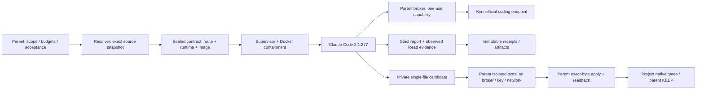

# Claude Code / Kimi Delivery

## Scope

2026-09-19 用户最初授权 M1–M9，后明确收敛为“先就把claude的搞好就可以，写一个文档记录好就可以”。本次交付范围因此为 **Claude Code native runtime + Kimi worker/deep + M1–M8**。Gemini已有代码、验证与blocker保留，M9暂停，不宣称全计划完成。

Source owner：`/home/reggie/vscode_folder/agent-subagent-router`。原spec/plan冻结于`docs/baseline/`；本文件记录实际交付，不改写历史设计状态。业务项目未被writer修改；旧MiniMax runner、CC Switch和global Claude配置保留。

## Architecture And Ownership

只有parent可持真实credential、选择route、批准scope和作最终验收。Runtime不持host key、HOME、daemon socket或host project写权限。Worker没有Bash/Task/Agent/MCP/nested delegation、tests、commit、push、KEEP权限。Read-only为Read/Glob/Grep；implementer额外允许精确`/candidate/owned`上的Read/Edit。

## Delivered Behavior

- M1：worker/deep live route、账号entitlement及独立OS/credential containment。
- M2–M5：typed contracts、双流排空、stdin、timeout/cancel、有限预算、source/Skill/Harness resolver、native projection、upstream identity、原子receipt/recovery、artifact hashes与secret redaction。
- M6–M7：实际Read结果与source lines/hash绑定、strict report、八任务双项目matched holdout及parent rubric/native gates。
- M8：单个干净已跟踪target、private candidate、重封存、独立测试、preimage/ownership校验、Linux原子exchange、实际bytes核验和应用后项目验证。

不存在自动model/provider fallback或无限retry。真实contract一次性消费；follow-up必须是parent检查已知outcome后创建的新bounded attempt。Dirty owned target、symlink、新增/删除/rename、mode变化、multi-file apply均拒绝。

## Runtime And Credentials

Claude Code：`2.1.277`，binary SHA-256 `722210f05ba494d8f6df69423c4d4f2960900f7a007d0532851c7a36e375cab7`。旧`2.1.77`在native probe将max降成high，故独立安装固定版本；未覆盖用户binary。

| Profile | Wire model | Thinking | Effort |
| --- | --- | --- | --- |
| worker | k3-256k | adaptive | high |
| deep | k3 | adaptive | max |

用户指出key已在CC Switch配置后，只读对应Kimi配置并私密复制到router owner-only credential store。只保存provider/file reference，不把secret放入repo、argv、prompt或receipts。新canonical qualification绑定当前credential fingerprint与原smoke artifacts。

Deep Pro entitlement由parent只读现有已登录Kimi console确认，并匹配key掩码；configured/entitled window为1,048,576，实际1M消费为 **NOT_EVALUATED**。小输入成功不证明最大容量。

## Canonical Receipts

Private receipts统一位于 `~/.local/state/agent-subagent-router/runs/<id>/invocation-receipt.json`，可用`subagent receipt <id>`核验artifact hashes。不得编辑历史receipt来补成功。

| Evidence | Invocation ID | Result |
| --- | --- | --- |
| worker smoke | fd8183cc-35ee-4b71-941a-c0309aef2db3 | PARSED / 1 wire |
| deep initial | ea6d855a-3b22-4ab4-97fc-781c75e34460 | HTTP 403 / 1 wire，具体原因未知 |
| deep correction | ca132501-53a2-45f9-9c7c-488395f517fc | PARSED / 1 wire |
| worker route qualification | 27ba7e0c-32b1-41a9-8210-4f49474e0a30 | 当前key绑定 |
| deep route qualification | 4f2d5dc8-4234-4665-b382-e82f1ad6cc00 | 当前key + entitlement绑定 |
| paired read-only qualification | bde21cb4-8b30-47a7-b194-5f14e961dd76 | QUALIFIED / policy_version 2 |

历史smoke不含后加的key fingerprint，因此没有改写原smoke；新parent qualification明确记录其独立证据边界。Identity来自固定TLS endpoint的上游响应与每次wire请求对应，不依赖CLI init或模型自述。

## Containment

当前Claude image：`sha256:08efb085f717fe5792d7380a069c3f770422fa09770d904e6e2436e3706e0c85`。Image同时绑定runtime及container entry hash。旧M7 image在当时通过，现在entry变化会阻断重新执行，不回写旧evidence。

本机bwrap uid-map仍不可用；使用现有非特权Docker，未修改sysctl。20项OS检查覆盖非root、只读root/source、private HOME/tmp/process/IPC、network none、seccomp/AppArmor/NNP、cap drop、host secret/proc/socket拒绝。真实native Read正向及proc/home/Bash/Task/MCP负向均通过。Parent test域没有broker、key、网络或runtime进程。

## M7 Paired Holdouts

Frozen run set：`420ae6c4-ab09-45fb-96a4-fac7d43800f2`。Rubric SHA-256 `4f95f6a952929a1fc8b1e39344eca60f209eea58ff24c4d6343a38c63c17ca54`。Source、rubric、profile和预算在执行前冻结。

| Task | Worker receipt / seconds | Deep receipt / seconds |
| --- | --- | --- |
| AI-VIDEO owner mapping | 82a4042e-c3cd-4b3b-9016-fc36e5634642 / 112.80 | 3889d58b-bd9f-4dc9-a5b4-5eda36c9b5a4 / 214.77 |
| AI-VIDEO evidence boundary | d6c82cc7-dce1-4f1e-8dc8-b4c4c33e5776 / 66.71 | 63999c6f-3840-4e06-86d4-22362d32aba9 / 128.70 |
| jizhang rules | bc03c1d1-5472-49d2-b5d7-f7b85fc71a35 / 62.93 | c98e1520-e4a3-4058-b14e-90582c328d0c / 139.16 |
| jizhang transfer | a1e2cd6c-87cf-4cff-bfd8-0c0234944e21 / 77.37 | 57a65ffd-a570-424e-bc2a-402af49dbfa4 / 186.65 |

Parent判断八份报告可用于冻结rubric，**不表示所有claims正确**。Canonical `parent-assessment.json`记录逐项verified/unsupported claims和questions。例如：worker将25个private modules数成26、将新责任一概要求新mixin；仅从AGENTS推断real adapter运行行为；将正向金额拒绝建议误当已有规则。上述claims未被接受。Deep亦有guard顺序等偏差。证据补问只涉及未选择scope/future policy，未阻断冻结rubric。

Worker在四组中的native耗时均较短；样本只覆盖这四任务，不作provider-wide优劣推断。完整parent人工核验用时 **NOT_MEASURED**；机械receipt重检耗时不可当人工核验时间。Actual billing cost未知，CLI估算不冒充账单。

`jizhang-rules-worker`初次`2cc2f151-0f65-4c55-b7d9-0cc72e4ded1c`因field/path不符为REPORT_SCHEMA_ERROR。显式修正prompt后用最后一次M1/M7 correction，parser/rubric/source均未放宽。M1+M7共12次任务预算已全部消耗。

jizhang parent gates在sealed源码/dependency投影上运行，排除.env、备份、财务data、uploads和数据库；无真实Provider。`npm --workspace server test`：**92 tests PASS**，receipt `c1e09f63-b039-49c0-9cb6-1a2cadc1772f`；`npm run lint` PASS，receipt `155d2736-89a0-4a0a-969e-ebd5f13e8942`。先前Vitest cache遇只读EROFS的失败`9af81e4a-cd7c-4393-ae30-1e9798c799c1`保留；修复仅开放私有cache，没有放宽source写权限。

MM-01…MM-10的十项synthetic regression通过；逐项历史追溯仍无法绑定原invocation terminal，全部维持 **UNRESOLVED_PROVENANCE**，未将旧report升级为历史PASS。

## M8 Live Candidate

Owned target仅为本repo干净的`src/agent_subagent_router/gemini_protocol.py`，修复重复native tool_id被接受。模型是Kimi worker，经Claude Code执行；目标文件名不代表调用Gemini。Parent先运行`tests/writer_duplicate_check.py`确认RED。

首次`731ee220-37d6-40c1-b47b-fa5504550c12`：PROTOCOL_ERROR / 4 wires，host未改动。原因writer prompt覆盖了原来的纯JSON及proposed_changes objects要求；模型返回prose/fence与strings。原失败不可进入apply，不人工补写report。

Parent修复prompt歧义后新建一次独立M8 correction（180s/8 requests），不占用也不重置M1/M7预算：

| Stage | Receipt | Result |
| --- | --- | --- |
| candidate generation | c46437b7-9694-47d8-bf6c-2af958a2b4db | PARSED / 3 wires |
| isolated exact-candidate test | fddd5b5b-398c-4136-b71c-c8070b3fa652 | PASS / no broker or network |
| parent apply | 7568776d-f39b-43ed-861e-a748dee9d198 | APPLIED / exact readback |

候选只增加seen-ID集合与重复拒绝。最终target SHA-256 `b62d6aa5787c42c1049c7f4d2de1bd3ccb54adbddc637e2b60f5bcc23be4e0a7`。应用后独立回归PASS，完整当前tree测试也通过。Apply原receipt的`project_native_post_apply=NOT_EVALUATED`是当时状态；后续parent证据另记，不改原receipt。

Atomic apply保留displaced inode，即使旧editor FD晚写也不丢弃。它不是filesystem CAS：交换后发现竞争会报告APPLY_CONFLICT/UNKNOWN并保留双方，不保证conflict时零host变化，不自动rollback。Apply前durable记录candidate/test IDs/hashes，之后记录交换结果，finalize失败仍可recover关联。Recovery对象被Git忽略但保留，不能自动清理。

## Verification And Review

最终完整suite含native与containment：**204 passed / 0 skipped，24.77s**。所有native conformance只调用本地fake upstream。`ruff check src tests scripts`与`git diff --check`通过。另有真实Kimi smoke/holdout/writer receipts，不能用204 tests替代live证据。

完整命令：`python -m pytest -q --native-conformance --containment-conformance`；环境为Micromamba `ai-video-p2`，显式配置当前Claude image/runtime hash与Gemini config paths。首次全量201 PASS/1 failure来自procfs进程被reap时的ESRCH测试竞争；修正为同时接受ENOENT/ESRCH，仍要求残留进程只能为zombie，未放宽supervisor终止行为。

独立`reviewer_max`已复核writer authority、exact candidate/test binding、topology/preimage races、retained inode、durable apply association、Docker overlap与失败receipt拒绝。最终Claude定向103项实际通过（首轮102 PASS、1 skip后显式image补跑1 PASS；Gemini主动排除），无未关闭blocking issues。Parent独立核对live candidate/report、test receipt和实际host hash后接受此单文件修改。

## Parent Acceptance

Parent post-apply acceptance receipt：`2fc26568-0988-492f-a17f-bf1c66603ca9`，绑定apply receipt hash、最终target hash与上述实际命令结果；proof标记为parent-observed session outputs，未冒充独立自动收集的process log。Independent review最终为 **accept with concerns**：Claude范围无blocking issues，保留单文件限制及SIGKILL/daemon recovery边界。

## Installed Checkpoint

- Source code commit：`9a968abe7495a3f396f3c333828bf34922db3c0d`，安装时`source_dirty_at_install=false`。
- Installed source/Skill hash：`f55b7f34beb6fe31d0b861ed7a32cb2244162cecc1dff052b2494e11181a4171`。
- Entry：`~/.local/bin/subagent`，SHA-256 `4b0cd80f8e12c865564188f0d189f87f40422af8d32a10a1f223cf05fd7b88f1`。
- Skill：`~/.agents/skills/external-subagent`，指向同hash的versioned安装；Skill SHA-256 `e0eb91d94caf1239b7fbd41ac39e856b76d5dcf543134444ffc17ba1bc60a2a6`。
- Manifest：`~/.local/share/agent-subagent-router/installation.json`。

从实际安装入口验证：`--version`返回`0.1.0`；`doctor`返回CONTAINMENT_QUALIFIED，20项OS和native tools均通过；`inspect`对新建generic fixture封存成功；`receipt`读取上述post-apply receipt并验证hash成功。Entry、Skill target与hash均由parent重新核对。此后补充的文档commit不改变installed source/Skill bytes。

日常调用见[README](../../README.md)。当前worker route ID为`27ba7e0c-32b1-41a9-8210-4f49474e0a30`，deep为`4f2d5dc8-4234-4665-b382-e82f1ad6cc00`；writer另需readonly资格`bde21cb4-8b30-47a7-b194-5f14e961dd76`。每个新任务仍需parent创建精确scope与有限预算，inspect后才能run；不可重放本轮已消费contracts。

## Open-Source Decisions

直接复用官方Gemini CLI（Apache-2.0）及现有Docker等成熟运行组件；Claude Code是官方专有发行物，不称为开源。Router core未直接移植开源模块。评估shinpr/sub-agents-skills、AGPair等后，其抽取会带入不符合当前权限/状态/env隔离的依赖，只复用接口与测试思路。详细取舍和license见[third-party-notices.md](../third-party-notices.md)。

## Deferred M9

按用户最新要求暂停。已有Gemini0.60.0、独立runtime/image、OAuth/CodeAssist broker与native/fake只读实现。Canonical preflight `c747cdfa-9b7b-42cf-a63b-915f4b39d633`为GEMINI_INELIGIBLE / UNSUPPORTED_CLIENT / **0 generation requests**。未继续第二repo调用、登录、onboarding或创建Cloud project。

selected Skills明确fail closed；最新Gemini rejection审计改动有自动测试，但在收敛范围前未完成独立复核。M9未获得跨backend live资格，不属于本次Claude交付结论。

## Remaining Boundaries

- Linux单文件writer限定，不支持跨文件事务、新文件、delete/rename或mode修改。
- Docker daemon/parent受信；parent SIGKILL或daemon失联的orphan recovery未完整验收。
- Deep实际1M消费、真实账单成本、历史MiniMax原始invocation provenance未验证。
- 模型report依然可能有unsupported claims；每个项目的测试、Harness和KEEP归parent。
- 全局安装只管理CLI/Skill/versioned package，原业务项目和global规则零写入；无remote/push/release/worktree。
