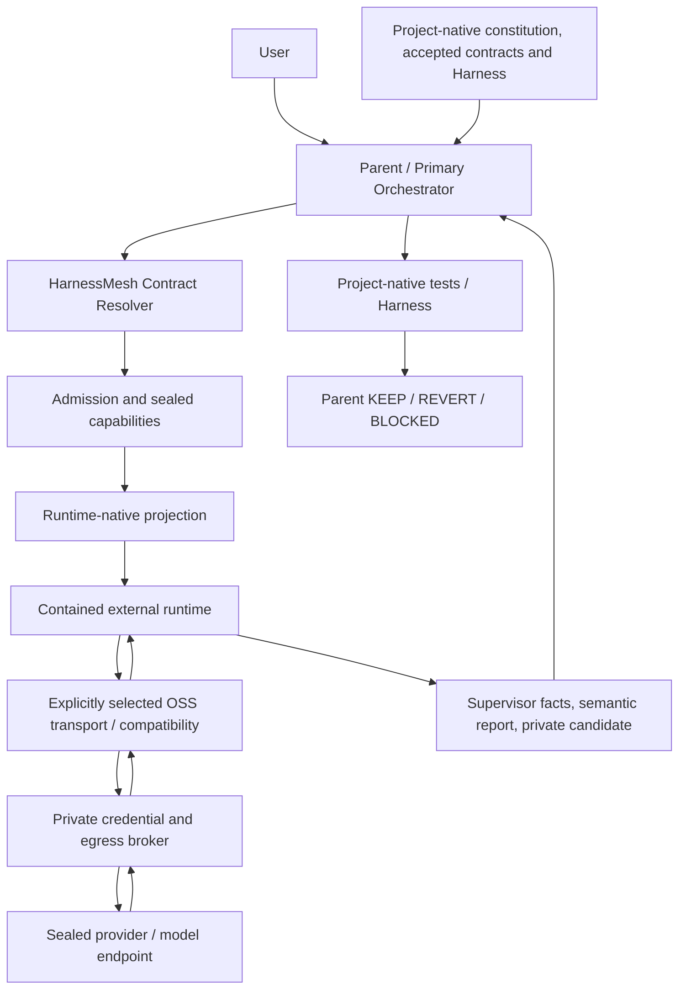

# HarnessMesh Architecture Design

Date: 2026-09-19
Lifecycle owner: `superpowers:brainstorming`, Architectural path
Document role: normative proposal; acceptance is a separate record binding these exact bytes by SHA-256.

## 1. Purpose And Design Basis

**S1 — Scope.** HarnessMesh 是全局、多项目的 external-subagent infrastructure。它把 parent 已授权的项目任务投影到外部 runtime，约束 delegated authority，收集可核验的 findings/evidence/candidate，再交还 parent。目标是组合成熟 OSS 与薄 authority layer。它不成为第二个业务项目 Harness、通用 autonomous agent framework 或项目 acceptance owner。

本轮交付仅为 research、architecture、Spec 与独立 Spec review。用户已批准模块组合方案 A、Project Contract Resolver/native projection、执行证据/恢复/writer 三段设计；这不是对 written Spec exact SHA 的最终批准。Implementation plan、runtime implementation、refactor、push/release 均不属于本轮。

**S2 — Current truth versus target contract.** 本文中 MUST/不得/必须是目标 architecture contract，不是实现完成声明。源码与当前运行事实仍由 implementation/status/records 管理。Current-design input 为源码 commit `a4d4c4e9c28346a92e4102b6c2fe393b4487bec4`、tree `b55fbcf3358177589ebcf941a94c5dacc011fd2f`；之后的 research/approval commits 未修改源码。历史 baseline 的文件存在、标题或旧授权不自动赋予本文 acceptance。

| Current surface | Verified boundary at research checkpoint | Target treatment |
| --- | --- | --- |
| Offline / native | 195 passed / 12 skipped；开启 native/containment 后 207 passed，均非 live generation | 作为当前行为输入；不证明未来 OSS composition |
| Claude Code → Kimi | Claude 2.1.277；worker/deep 有 canonical route qualification，读回有效；current research invocation `f51ac150-9dc4-431d-b3a7-370e8a4cd332` 为 OUTCOME_UNKNOWN | 每次 admission 重新核验适用资格；不能用历史 success 代替本次 terminal evidence |
| Deep profile | client `k3[1m]`、wire `k3`、requested max；account entitlement 可验证；实际 1M consumption 未验证 | 保留 requested、entitled、observed 的区别，不声称远端权重或实际推理强度 |
| Gemini | native/fake conformance 有证据；live Code Assist account `GEMINI_INELIGIBLE`，M9 partial | 当前不具项目 live dispatch 资格；不得借其他 route 补齐 |
| Scoped writer | 单个既有 clean tracked file 的 private candidate/test/apply 链已有 evidence；exchange 非 CAS | 采用 §6 的受控边界与恢复语义；不泛化为多文件事务 |
| OSS | 当前 Python core 未直接采用本轮候选模块 | 目标复用选择见 §2；升级/替换必须重新验证，不能假装已集成 |

**S3 — Research inputs.** Research 是 evidence，不是第二套 normative owner。下列 artifacts 的 exact bytes MUST 一并进入 review snapshot；其结论有冲突时由本文明确选择，不能让实现者自由挑选。

- [Current architecture truth](../../research/2026-09-19-current-architecture-truth.md)：ownership、qualification、drift、MiniMax、writer 的源码依据。
- [Research synthesis](../../research/2026-09-19-architecture-reuse-synthesis.md)：方案比较、能力选择、CUSTOM 的逐项 burden-of-proof 与 LOC 范围。
- [Routing/dispatch audit](../../research/2026-09-19-routing-dispatch-reuse.md)：CCR、shinpr、CodeRouter、LiteLLM、ACP routers 的精确模块、许可证、活动及负面证据。
- [Projection/lifecycle audit](../../research/2026-09-19-projection-lifecycle-reuse.md)：wshobson、AGPair、agent-harness、Agent Skills、Tomli-W 等。
- [Commodity runtime audit](../../research/2026-09-19-commodity-runtime-reuse.md)：AnyIO、HTTPX、ACP SDK 的机制接口、测试和限制。

## 2. Architecture And Ownership

**A1 — Authority.** Delegation follows User → Parent Primary Orchestrator → applicable project-native authority → HarnessMesh delegated authority → external worker。Project-native authority 可包括 AGENTS.md、CLAUDE.md、applicable Skills、accepted spec/plan、policy、tests、AC 与 Harness。Parent 解释用户授权并解决项目语义冲突；HM 只 resolve/project/enforce 已授予的边界。Worker、runtime、OSS component 和 reviewer 均不得修改 AC、silent-expand scope、授予权限或宣布最终 acceptance。KEEP/REVERT/BLOCKED 与 completion 的唯一裁决 owner 是 parent，且受项目原生约束。该层次不改变平台/用户指令的既有优先级。

**A2 — Vocabulary.** `backend_adapter` 是 HM 到运行机制的适配器标识；`runtime` 是 Claude Code/Codex/Gemini CLI/Grok CLI 等可执行 agent 及版本；`provider` 是被授权的服务方；`endpoint` 是固定协议/主机/路径；`model` 分为 requested client alias 与 resolved wire model；`profile` 是 parent 选择的有限能力/effort/context/budget 配置。一个 provider 可以由多个 runtime 访问；相同 runtime 也可访问不同 provider。任何身份字段不得用笼统的“Kimi backend”替代。

**A3 — Single owners and interfaces.** 各组件仅拥有下表职责。接口名是逻辑 contract，不要求某种 programming-language API、目录拆分或新 service。

| Owner | Input → output | Does not own |
| --- | --- | --- |
| Project Contract Resolver | parent task + selected project inputs → resolved contract + content manifest | business truth、自动批准引用 |
| Native projector | resolved contract + qualified target schema → native bundle + source map | 权限升级、修改 canonical project files |
| Admission/qualification policy | contract + runtime/route/containment evidence → admitted capability or typed refusal | fallback、选择新任务 |
| Process supervisor over OSS primitives | sealed invocation → bounded process observations/artifacts | 语义 correctness、项目通过与否 |
| Credential/egress broker | per-invocation capability + wire request → allowlisted upstream request/observation | worker orchestration、模型自述认证 |
| Receipt owner | associated deterministic facts + filtered artifact descriptors → durable execution receipt | project acceptance、reviewer verdict |
| Candidate gate | sealed candidate + parent test/apply authority → test/apply/recovery evidence | 自动 KEEP、重写 AC |
| Parent | evidence/findings/candidate + project Harness → adjudication/disposition | 不得把此责任转交给 worker 或多数投票 |

**A4 — Selected OSS composition.** 采用方案 A；generic mechanisms 优先下表组件，HM 自研仅限 authority policy 与必要的窄 adapter。是否启用某项由安装时的显式 capability/qualification 决定，不由运行失败触发选择。每个 invocation 只有一个封存 transport graph。

| Capability | Mode and exact selected surface | Binding boundary |
| --- | --- | --- |
| Process / cancellation primitives | WRAP AnyIO `open_process`、task groups/cancel scopes | HM 提供 explicit env、output caps、deadline 与 group/container cleanup policy；不使用 unbounded `run_process` |
| HTTPS / streaming | WRAP HTTPX `AsyncHTTPTransport` / `AsyncClient` | broker-owned URL/SSL、`trust_env=False`、redirect/retry disabled；流量限额与身份谓词不委托给 HTTPX |
| Claude compatibility / tool transforms | WRAP pinned CCR core/gateway distribution | 仅需转换的 tuple 启用；isolated sidecar 只可访问 HM broker，不能编排任务。已兼容的 direct route 可显式保留，不构成自动备用路径 |
| Existing CLI argv/event support | VENDOR shinpr `_builder.py` / `_stream.py` 的目标 CLI 必需函数 | 复用前排除 credential loader、permission defaults、executor 和 universal-prompt concatenation；保留 notice 与 upstream mapping tests；无关 CLI 不导入 |
| Native ACP protocol | WRAP official Python SDK `ClientSideConnection` / `Connection` | 仅 runtime 的 ACP tuple 通过资格后启用；parent-owned streams/lifetime，不采用 SDK spawn helper 或第三方 controller |
| Skill envelope | DIRECT `agentskills/agentskills/skills-ref` parse/validate | 只验证 portable core；native extensions 由 target schema 完整校验，不静默丢弃 |
| TOML serialization | DIRECT Tomli-W `dumps(multiline_strings=False)` | 稳定排序、roundtrip，permission/model schema 仍由 projector 负责 |
| Filesystem, digest, JSON, isolation | DIRECT Python stdlib、Linux/Docker mechanisms | HM 负责关联、授权与恢复 policy，不实现新的 filesystem 或 container runtime |

CCR 的 exact candidate 是 research pin `a034b0c51cdd1b5628bbff545821f5540d30c6c5`；core package 为 private，不假定存在稳定独立 npm API。其 provider preset 不是 route qualification；例如 Kimi preset 的 `kimi-for-coding` 不等于 HM sealed K3。Anthropic response model rewrite、unknown tag default route 和 reported wrong-route traces 要求 broker 在 response compatibility rewrite 之前独立观察实际 upstream。Sidecar configuration MUST 关闭 fallback、plugins、nested agent/MCP、account probes、body capture 与 host-config mutation；OS egress boundary 独立执行限制。若 pinned distribution 无法实现这些约束，相关 tuple 不准入，不以自写等价 gateway 或启用其他 route 代替。

`agent-harness` public text-only `plan({cwd})` 保留为可选 drift advisory，不作为完整 native compiler；wshobson full generator/emitter、AGPair controller/receipts、CodeRouter、AgentPlugins、HF publisher 为 REFERENCE_ONLY。LiteLLM 是未来 provider-translation alternative，本 contract 不启用；superagent gateway 缺适用 license evidence，不能执行性采用。各候选的确切 pin/license/tests/issues 在 S3 research 中；这些未选路径不得同时形成第二 owner。

**A5 — CUSTOM limit.** 自研边界仅是 project contract resolution/native authority mapping、delegated admission/credential capability/qualification predicates、evidence association/identity acceptance/recovery、candidate disposition/apply authorization。四项 DIRECT/WRAP/VENDOR/FORK 的具体不足、upstream blockers、production/test LOC 与维护责任由 research synthesis 的 CUSTOM table 提供 evidence；本文选择其职责而不把估算当 LOC 目标。任何新增 commodity CUSTOM 需要重新提供同等 burden-of-proof并重新审查 Spec，不能以“没有一个框架满足所有需求”作为理由。

## 3. Project Contract Resolution And Native Projection

**C1 — Three separate inputs.** Repository Constitution 是适用的持久项目规则；Current Task Contract 是本次 goal、role、owned/read paths、accepted refs、selected Skills、verification requirements 与有限授权；Runtime/Transport Protocol 是执行机制、provider/model/profile、schema 与预算。三者分别保存 provenance，不把 transport 控制字段混入模型语义输出。Parent 必须显式选择 accepted spec 与 active plan 的 path/hash/acceptance evidence；若本任务无适用文件，应明确 `not_applicable` 及原因，不能因为路径带 `spec`/`plan` 就视为 accepted。Review draft 本身应作为待审 source，而不是伪装成 accepted ref。

**C2 — Resolve and freeze.** Resolver 从明确的 repository root 与授权 read/write scope 出发，收集适用 ancestor/nested instructions、显式 constitution/Harness refs、selected source/Skills 和 parent 声明的必要依赖闭包。Discovery 规则及 precedence 必须版本化，并与 target runtime 的实际 discovery/activation 相符；跨 runtime 规则同时适用但无法确定优先级时返回 typed conflict。Symlink、路径逃逸、非 regular file、超预算、缺失 required ref、hash/mode 漂移或扫描期间 instruction 集合改变均拒绝封存。缺少项目 Harness 时 parent 必须显式说明没有该 Harness 并声明可用的 project-native verification，HM 不创建替代业务 Harness。

文档中的 prose links 不被假装成自动完整语义依赖图。Parent 负责标明必须跟随的 refs；resolver 验证声明的闭包。Worker 发现未提供的必要文档时只能报告 evidence gap，由 parent 扩充授权、产生新 snapshot；不得自行越界读取。Scope 最小化不允许截断适用 mandatory rule 或所选 Skill 的必需资源以凑预算。

**C3 — Resolved contract.** 输出包括 project identity（root + Git commit/tree 与允许的 dirty/untracked/mode manifest）、task identity、authority/precedence、accepted refs、selected Skills、verification contract、permissions、budget 和 target capabilities。Content manifest 为每个输入记录 source path、category、selection reason、size、bytes SHA-256、source mode、projection destination；instruction absence observations 也参与 seal。同一 content/policy/projector/runtime-schema input MUST 生成相同 semantic contract 和 projection bytes；invocation ID、当前时间、临时路径等放在独立 invocation envelope，不污染 content identity。Admission 前验证 sealed snapshot 与适用 host preimages；文件后续变化不能修改运行中的 immutable snapshot，必须创建新 invocation input。

**C4 — Native projection.** Claude（含 Kimi/GLM/MiniMax via Claude）使用 Claude-native rules/Skills/tools；Codex 使用其 native AGENTS/Skills/agent format；Gemini/Grok 使用已注册且经过验证的 native representation。没有该 renderer、permission equivalent 或 native proof 的 target 返回 `UNSUPPORTED_REQUIRED_CAPABILITY`，不能套同一 giant prompt 并标记成功。

Canonical semantic record 保留 shared semantics 与明确 target extensions。Portable Skill core 可经 skills-ref 验证；全部 extensions 同时经其 native schema 检查，unsupported mandatory field 不得被忽略。Bundle 保留 selected Skill 全部授权 resources 的 bytes、目录关系和所需 executable mode；受控 mount 可以去掉写权限，但该映射必须显式记录。Projector 不修改 canonical root AGENTS.md/CLAUDE.md/业务 Skills。OS capability enforcement 可以比 runtime 声明更严格，不能更宽；如果更严格导致任务所需能力无法成立，拒绝而非静默降级。

**C5 — Ambient input exclusion.** Worker 只能看到 snapshot/projection 和显式授权工具数据。Host HOME、user/global agent configs、项目 hooks/plugins/MCP/credential helpers、外部路径和未选文档不隐式加载。每个 runtime 的允许加载位置/权限/禁用方式都必须有 local native tests，文件存在或文本相同不证明 activation/precedence 等价。Projection conflicts、source map 不完整或 drift 立即使该 invocation 不具执行资格。

## 4. Admission, Isolation And Credentials

**P1 — Trust boundary.** Parent、host owner、HM policy/receipt storage 与经过选择的 broker/OS mechanism 是 trusted computing base。Worker/model 与其可操作的 runtime process、project-provided content、tool output 不能授予新权限；兼容 sidecar 不获 parent authority。模型遵守 prompt 不是 isolation。本文不声称防御恶意 root/parent 或以本地 SHA 提供 nonrepudiation；这些威胁超出该 trusted-host contract。

**P2 — Admission seal.** 每次调用封存 backend adapter/version、runtime binary/image digest、provider、固定 endpoint/protocol、client alias→wire model 映射、profile/effort/context bounds、tool grants、role、input/projection hashes、qualification refs 和预算。安装 registry 只描述候选 capability，不等于准入；所有 required dimensions 的适用资格都有效才可放行。Profiles 不得被 worker、model recommendation、CCR tag 或上下文长度自动升级；fallback model/provider/endpoint/runtime 禁止。Nested delegation 默认 deny；本 Spec 不授予例外路径。Reviewer 固定 read-only；writer 仅 §6 的 candidate-write capability。

**P3 — Enforced containment.** 在项目 bytes 或工具准入前必须具备对应 runtime/image/config 的 OS/native containment qualification。Worker 的 host filesystem、process execution、network、tool、MCP、child dispatch 与 write scope 由实际边界限制；prompt 中的 read-only 字样不足够。Runtime-specific aliases/custom/freeform tools 不能借转换扩大权限。工具实际调用由 supervisor/adapter 捕获并关联 invocation；禁止的 capability 出现时停止交付并记录 violation，不把它当普通 non-blocking finding。

**P4 — Credential ownership.** 真实 credential 存在 private provider-specific storage，通过 parent-only reference 加载并由 broker/runtime-side auth channel 注入；reference 不进 model-visible contract。Worker 只知道 capability 获授；ephemeral token/socket capability 也属于 secret，只限 runtime transport channel，不能被 worker tools 读出。真实 key 不交给 CCR 或模型，provider 认证只在受控 TLS endpoint 使用。Storage/config 的 owner/mode、env allowlist、argv、fd/mount、diagnostic、crash paths 都属于资格检查。

Secret 不得进入 repo、prompt、semantic report、receipt、diagnostic、artifact 或日志。防线顺序是最小输入/credential 不进入模型域、禁 body/auth logging、持久化前过滤与检测、发现泄漏即隔离输出并撤销 capability。Artifacts 只对保存后的 filtered bytes 作 hash 并明确 representation；不能把 redacted artifact hash 标成 raw-wire bytes hash。Known-key redaction 或敏感文件名过滤不构成对任意 repository 内容无 secret 的证明；无法满足输入保密边界的路径不得授予。已发现污染的 report/candidate 不得进入后续测试/apply/acceptance；receipt 只记录不含秘密的 violation metadata。

## 5. Execution, Identity And Receipts

**E1 — Bounded lifecycle.** Invocation states 为 `SEALED → ADMITTED → RUNNING → STOPPING → FINALIZED`；拒绝在执行前终止并记录 admission reason。所有离开 RUNNING 的路径——包括 terminal report、exit 0、failure、cancel、timeout、output limit 或 supervisor shutdown——都必须先进入 STOPPING。STOPPING 首先关闭 broker/tool 的新请求准入并不可逆地 revoke invocation capability，再 bounded-drain 或标记 in-flight request unknown，执行 process-group/container cleanup、有限等待及升级终止，最后冻结 transport/process/cleanup observations；terminal parse 在此 barrier 前只能是 provisional。只有 no-new-work/revocation barrier 已完成且 cleanup 的实际结果已记录，receipt 才可 FINALIZED；cleanup 可以失败或 unknown，但不能仍允许该 invocation 发起新请求。无完整 terminal observations 或 supervisor/daemon crash 时是 `OUTCOME_UNKNOWN`，不得推断“未执行”。Durable intent/last observations 支持恢复，但不发明 missing terminal facts。Finalized receipt immutable；更正/恢复结论必须成为关联的新 parent record。

AnyIO 提供 spawn/streams/cancellation primitives；HM wrapper 同时 bounded-drain stdout/stderr，禁止 shell interpretation 与 inherited environment，执行 aggregate output/context/request/wall/idle budgets。Wall 使用 monotonic deadline；idle 明确定义为实际 runtime I/O 活动，不声称 semantic progress。Provider request timeout 从剩余 wall budget 派生，不会延长 parent deadline；broker 也计算 request count/body bytes。预算耗尽不能通过 restart/reset receipt 消除。Cleanup 未验证时不声称完成撤销所有副作用。

**E2 — Attempts and replay.** 默认一个显式 attempt，OSS 内置 automatic retry/fallback 关闭。Parent 可在检查旧 receipt/outcome/side effects 后授权新的有限 attempt，绑定 predecessor、reason、相同或新获授权的 seal 和剩余 task budget；新 attempt 不清零累计消耗。未知结果不能自动 replay，尤其不得重复可能发生 mutation 的动作。新的 route 选择必须是新授权/qualification，不是错误恢复中的 silent substitution。

**E3 — Identity acceptance.** Requested alias、resolved wire model、runtime-reported model、gateway-rewritten model、authenticated upstream observation 分字段保存并标记 provenance。Broker 对每个实际 wire request 检查固定 host/path/protocol、model/effort、headers 和封存预算；独立记录 request association 与经验证 TLS endpoint 的 response identity。观察位置在任何 CCR response rewrite 之前。Redirect、未授权 endpoint、无法关联 response、missing/mismatched identity 或未知 alias 映射均不满足 route identity gate。Partial streaming response 不等于完成的 generation。

可信等级目前最高为 `authenticated_endpoint_declaration`：证明该 endpoint 的响应声明及实际发送参数，不证明远端权重、内部 reasoning effort 或实际 context consumption。Runtime init、配置 model 字段、worker 自述、CCR trace、ACP model list、API success 都不能单独提升该等级。资格只覆盖明确 tuple 与 observed capability；例如 entitlement=1M、request=max 与实际消费/内部执行必须分开。

**E4 — Orthogonal execution receipt.** Deterministic owner 生成以下信息，不接受 model report 填写这些事实。Unsupported/not-observed 用明确状态与原因，不以空值代替成功。

| Dimension | Required facts |
| --- | --- |
| Association | invocation/attempt/parent/task/project identity、predecessor、source/projection/contract hashes、policy/schema versions |
| Requested execution | backend adapter、provider、endpoint、runtime binary/version/image、client/wire model、profile、effort/context limits、qualification refs |
| Observed transport | per-wire request correlation、actual allowed route、upstream observation/proof、count/bytes、retry count |
| Process and budget | start/end/duration、exit or missing exit、reason、timeout/cancel/truncation、cleanup outcome、budget limits/consumption |
| Artifacts and parse | filtered stdout/stderr/report descriptors、size/hash/representation、terminal report presence、schema/parse state、tool/evidence verification |
| Candidate | absent or exact candidate seal/owned paths；test/apply refs only when parent actually ran them |
| Acceptance | worker acceptance is never a field of authority；project decision remains separate parent-owned record |

Process、identity、parse、evidence、scope 与 budget 状态不能互相覆盖；aggregate convenience label 必须可由原始维度重算，不能丢弃冲突。Receipt finalization 仅代表 observations 已封存，不代表这些维度均通过。Artifacts 与 receipt 经 association/hash/size/owner checks、原子 publish/fsync；incomplete receipt 的恢复读数明确标记 unknown，禁止自动 continuation。通用 JSON/hash/filesystem plumbing 复用成熟机制；这些 association predicates 归 HM。

**E5 — Semantic report and normalization.** Worker canonical report 保持 `findings`, `proposed_changes`, `evidence_refs`, `uncertainties`, `questions` 五个字段；模型不负责 DONE/transport state/model proof/acceptance。Reviewer findings 在 `findings` 中带稳定 ID、`blocking_candidate` 或 `non_blocking`、trigger、impact、snapshot source reference 与建议验证方式；questions/uncertainties 不能被吞掉。实现者可以返回 candidate proposal，但实际 candidate bytes/seal 由 deterministic layer 采集。

仅 schema 预先定义且无歧义的表示变换可 normalize（如 JSON 外层空白）；原始输入与变换版本应可追溯且服从 P4。禁止猜测模型意图、自动补 evidence、把 string `"null"` 猜成 null，或用 retry 达到形式 parse success 后抹去失败。Legacy MiniMax `DONE_WITH_CONCERNS` + non-empty questions 等语义矛盾维持其历史 `PROTOCOL_ERROR`；旧协议移除不追认历史成功。Structured-output exhaustion、tool mismatch、零 terminal evidence、read-heavy findings 和错误 architecture conclusions 分别保存，不混成一个模型 verdict。

**E6 — Usability versus acceptance.** Parent 可以调查 failed/unknown invocation 中经过安全过滤的部分 findings，但它们必须保留 incomplete provenance，不能计作完成的 review、qualified candidate 或通过的 project evidence。无实际 Read/tool evidence 的引用不能当成已核查来源。Parent 对有价值但证据不全的 finding 重新调查，不为让某个 provider 通过而降低 schema、identity、scope 或 Harness gate。

## 6. Private Candidate, Controlled Apply And Recovery

**W1 — Writer admission and output.** Writer 必须同时满足相应 route、containment、read-only capability experiment 与 writer qualification。当前 contract 范围是 Linux 上一个 parent 明确拥有、既有、clean tracked regular file；不授予新建、删除、rename、metadata change、多文件 transaction、commit/push。Worker 在 private candidate workspace 中执行 candidate-write；trusted host project 对它不可写。授权 write path、source preimage hash/size、project identity、input seal 与 candidate byte limits 预先封存。Parent 还必须用版本化 platform policy 封存完整 inode metadata identity，至少覆盖 uid/gid/mode/link count、全部 extended attributes、POSIX ACL、security label/file capabilities 与 filesystem flags；敏感 metadata value 留在 private control evidence，普通 receipt 只存关联 digest。当前 single-file contract 要求 link count=1；任一 metadata 无法完整读取、无损重建或 post-apply 核验，均在 mutation 前以 `UNSUPPORTED_REQUIRED_CAPABILITY` 拒绝，不能把未知属性静默丢弃。

**W2 — Candidate and test binding.** Supervisor 提取 private output，拒绝多余路径、symlink、escaped path、未授权 mode/metadata、secret pollution 或内容超限；生成 immutable candidate manifest/seal。Candidate 只贡献授权内容 bytes；target inode metadata 只能由 trusted parent apply layer 从 W1 的 sealed private preimage 重建，worker 输出不得控制。Parent 选择符合 project verification contract 的测试命令，在无 provider key/broker/network 的隔离环境针对 exact candidate 与对应 source snapshot 执行。测试 recipe、argv、image/runtime、candidate/source hashes、完整 process result/artifacts 都进入 parent test receipt。Worker 不能自行改 tests/AC；candidate-test PASS 不是项目 acceptance。需要其他权限的项目验证必须另有明确 parent 授权，不能通过 candidate-test 暗中获得。

**W3 — Apply authorization.** Parent 明确选择 candidate/test pair，验证 receipt kind/association、source content 与完整 metadata preimage、target ownership/identity、candidate hash、test identity和全部适用 gates。任一 stale/unknown/failed 绑定禁止 apply。Trusted apply layer 在 private replacement inode 上重建并读回 exact sealed metadata 后才可写 durable intent；atomic filesystem operation 与之后 content/metadata readback 有独立 facts。Apply 完成后仍须 parent 的项目原生验证与最终 disposition；不把 `APPLIED` 写成 KEEP。

**W4 — Concurrent changes and unknown outcome.** 当前 single-file exchange 不是 compare-and-swap。Initial preimage check 之后仍可能出现 concurrent content 或 metadata change；exchange 后必须读取 displaced object 与当前 target，核对实际 content hash、完整 metadata digest、inode/directory identity。只有 displaced preimage 和当前 candidate 的 content/metadata 都满足 sealed expectation，才可记录 `APPLIED`；否则 `APPLY_CONFLICT`，无法可靠观察时 `APPLY_OUTCOME_UNKNOWN`。

Conflict/unknown 时目标可能已经改变；不得报告“未修改”。Parent 保留 displaced inode/recovery intent 和 candidate evidence，不自动 unlink、overwrite、rollback 或 retry；后续 recovery 必须重新观察现存 bytes、完整 metadata 与任何进一步修改，再作显式裁决。Retained inode 可能仍被其他进程持有，不能把它视为不可再变的历史 content/metadata snapshot。若无法验证恢复对象身份、内容或 metadata，则继续 BLOCKED。任何 REVERT 也是受控 mutation，需重新验证 preimage，不能覆盖更新的用户数据。自动全项目 rollback 与多文件 atomicity 不在本 contract 内。

## 7. Qualification And Verification Contract

**Q1 — Qualification dimensions.** Capability evidence 分开维护：offline behavior、runtime-native fake conformance、OS containment、authenticated live route、profile entitlement、read-only task experiment、writer/test/apply conformance、project task acceptance。`doctor` 的 fake/native PASS 不证明 live identity；route smoke 不证明业务正确；一个 provider 的成功不传播给同 runtime 的其他 provider。Evidence MUST 绑定它实际测试的 runtime/image/adapter/policy/protocol/model/profile/config/credential fingerprint及适用 source/input hashes；敏感 fingerprint 只保留在 private parent control evidence，不进入 model prompt。

**Q2 — Freshness and invalidation.** 资格声明必须有唯一类型、版本、applicable tuple、creation time、有效条件和 issuer/evidence refs。Binary/image、adapter/transform、policy、required tool schema、route/model/profile、credential identity 或 qualification 所依赖的配置变化使对应证据失效。Deep entitlement 依当前 account contract 的 24h freshness 检查；其他证据没有时间界限不能被误读为永久有效，仍受其 dependency fingerprints 约束。未定义 qualification policy 的新 tuple 不准入。禁止刷新时间戳替代重新观察，禁止给历史无 credential association 的 evidence 补造关联。

**Q3 — Required adversarial verification.** 下列是 architecture conformance obligations，不是本轮 implementation tasks 或通过声明。每项结果必须绑定最终被测 snapshot 与实际运行命令；缺 evidence 记录 NOT_EVALUATED/BLOCKED。

| Boundary | Positive and negative proof required |
| --- | --- |
| Resolver | exact refs/closure、precedence、required source absence、scan races、symlink/escape、budget、unexpected ancestor/native instructions |
| Native projection | 各 target 的实际 loader/discovery/tool behavior；binary/script mode fidelity、reserved collision、unsupported fields、host config/hook/MCP exclusion |
| Authority/credentials | Read-positive 与 forbidden host/proc/shell/Task/MCP negatives；真实 key/capability 不可见；argv/env/log/exception paths；no credentialed test environment |
| Transport/identity | wrong-model、missing/rewritten identity、alias、redirect、no fallback、per-wire association、CCR metadata/schema、custom/freeform call/result correlation、bounded streaming |
| Lifecycle | stdout/stderr backpressure、idle/wall/remaining request timeout、request/output cap、cancel/kill descendants、daemon/supervisor loss、incomplete durable receipt/recovery；正常 exit 0/terminal report 下 delayed sidecar request 与 in-flight response 也必须先经 no-new-work/revoke/drain barrier |
| Protocol/regression | MiniMax legacy contradictions、structured-output exhaustion、missing terminal/Read evidence、literal-null ambiguity、useful partial findings without acceptance |
| Candidate/apply | exact source/candidate/test binding、multi-path rejection、hard-link rejection、uid/gid/mode/xattr/POSIX ACL/security label/capability/filesystem-flag preservation 或 pre-mutation refusal、concurrent content/metadata edits、parent-directory change、exchange failure、unknown readback、retained inode content/metadata drift、controlled recovery/post-apply Harness |
| Reviews/acceptance | same spec/source/evidence snapshot、peer result invisibility、blocker union/adjudication、false-positive evidence、new snapshot reruns both、user SHA binding |

**Q4 — Task completion eligibility.** Parent 必须核验 applicable execution/identity/scope/evidence gates、required project-native verification 和 review contract。对需 dual review 的最终状态，两侧必须成功完成同一 final snapshot 的独立审查；唯一例外是 G7 定义且证据完整的 non-semantic descendant，可通过显式 carry-forward chain 继承其直接 predecessor 的双审结果。所有历史 blocker candidate 经 evidence adjudication 关闭，final unresolved blocker count 为零，且 project Harness 在最终状态通过，才具备 eligibility。它不自动授予 commit/push/release 或替代用户要求的批准。关于本 written Spec 的额外 approval 条件由 §9 单独拥有。

## 8. Dependency And Change Boundaries

**V1 — Pins and maintenance.** 每个实际采用的 OSS component 固定 exact upstream commit、release artifact digest、transitive lock、license/notice 和 qualification refs；research HEAD 与 release number 不自动等同。Upstream 维护 generic mechanism，HM 维护 adapter/authority predicates、native compatibility、schema migration 与 breaking-change responsibility。保留原许可证，禁止从无适用授权的仓库复制实现。上游 issue 的 open/closed、stars、README support matrix 只是研究线索，不能作为 E2E evidence。

**V2 — Replacement and compatibility.** 后续迁移到 AnyIO/HTTPX/CCR 等必须保持本文 contracts，只有新 tuple 通过相关 gates 才可显式切换；old path 的退役与数据/schema migration 应由未来 accepted plan 说明。禁止同时保留两个 active authority/receipt/qualification owners；同一 invocation 不存在“先新后旧”的隐藏执行路径。新 receipt/schema 不得将旧 unknown/失败/未关联 evidence 解释成成功。Breaking changes 由 parent 明确接纳、绑定新资格，不能由 provider preset 或 dependency latest 自动触发。

**V3 — Spec drift during future implementation.** 若实现发现本 accepted Spec 有错误或缺失导致语义必须改变，停止该部分实现，重新进入 brainstorming，修改 Spec、Self-Review、Risk Gate、新 hash，并在 G2 仍要求时完成双独立审查与用户批准，再更新绑定新 hash 的 Plan 后恢复。不能在实现中悄悄改变 semantics，也不能为使 Spec 看似一致而在本轮修改 implementation。

## 9. Risk-Triggered Review, Acceptance And Handoff

**G1 — Lifecycle and Risk Gate ownership.** Spec authoring 由已读取的 `superpowers:brainstorming` Architectural path 管理：context/reuse research → approaches/sectioned design approval → written Spec → inline Self-Review → Spec Risk Gate → applicable independent review → 原 User Review Gate。Implementation planning 仅未来单独调用 `superpowers:writing-plans`；本轮不调用、不产出 plan。

Review 是 **risk-triggered**，不是 artifact-triggered。Parent 只在 Spec、durable Plan 或 final implementation 的稳定 checkpoint 运行对应 Risk Gate；文件存在、diff 大小、测试通过或 reviewer 可用本身均不是 trigger。每次 decision 必须记录 gate、snapshot identity、命中的 exact HARD/SOFT rules、soft count、evidence 和 `DUAL_REVIEW_REQUIRED` 或 `DUAL_REVIEW_NOT_REQUIRED`。任一 HARD 或至少两个 SOFT 产生 `DUAL_REVIEW_REQUIRED`；否则采用该阶段的 workflow self-review、project-native verification 与 normal review。Risk Gate 只决定 review 强度，不授予下一阶段、实现、KEEP、push 或 release 权限。

**G2 — Spec Review Gate.** Architectural Spec 的 HARD triggers 是：architecture/module ownership/authority 改变；public API/CLI/schema/protocol/persistence/state machine 改变；Harness/Agent authority/acceptance/review semantics 改变；routing/fallback/retry/recovery/completion semantics 改变；credential/security/permissions/sandbox 改变；global/cross-project infrastructure；multi-runtime/multi-provider；migration/durable-state compatibility；错误设计可能造成 costly 或 hard-to-reverse effects；同一 surface 曾有 serious regression/incident；仍有 materially different architectural choices；用户明确要求 review。SOFT triggers 是：三个以上 meaningful subsystems；新 external dependency；concurrency/async；新 provider/runtime/backend；complex acceptance criteria；multi-agent 或 long-running implementation；research evidence materially disagrees；significant design uncertainty。任一 HARD 或 SOFT ≥ 2 时双审，否则 Self-Review 后进入 User Review Gate。

**G3 — Plan Review Gate.** 只有 `superpowers:writing-plans` Routing Gate 在未来确实要求 durable Plan 时才运行。HARD triggers 是：correctness-critical execution ordering；migration/cutover/backfill/conversion；destructive/irreversible step；credential/production/external side effect；multi-agent coordination risk；complex cross-subsystem dependency ordering；non-trivial rollback/recovery；backward-compatible rollout；multi-provider/runtime rollout；Harness/CI/release-control modification；accepted Spec 明确要求；用户明确要求 review。SOFT triggers 是：四个以上 substantial milestones；multiple execution owners；new dependencies；new install/deploy path；complex verification matrix；rollback 超过 simple revert；long-running execution；staged rollout/feature flags；Spec review 发现多个 serious blockers；multi-version compatibility。任一 HARD 或 SOFT ≥ 2 时双审，否则 writing-plans Self-Review 足够。本条不授权本轮创建 Plan。

**G4 — Final Implementation Review Gate.** 只在未来 stable final implementation snapshot 运行。HARD triggers 是：architecture/ownership/authority implementation change；API/schema/protocol/persistent-state semantics change；Harness/routing/fallback/retry/recovery change；credential/security/permission/sandbox change；production/external side effect；migration/durable state；concurrency/distributed behavior；new provider/runtime/backend；global/cross-project infrastructure；high-risk filesystem/state writer；同一 surface 曾有 serious regression；执行中发现 Spec defect/scope drift；major blocker 被发现并修复；substantial implementation 由 external agent 产生；用户明确要求 review。SOFT triggers 是：multiple important modules；large coupled diff；new dependency；new failure/recovery path；significant test-contract changes；implementation materially deviated from Plan；acceptance depends on complex evidence；rollback non-trivial；reviewers already disagree；external-agent result required substantial parent reinvestigation。任一 HARD 或 SOFT ≥ 2 时双审，否则 project-native verification + normal review 足够。

**G5 — Freeze and independence.** Self-Review 检查 placeholders、internal contradictions、scope 和 ambiguity 后，parent 冻结 exact reviewed bytes。Review manifest 的 `review_snapshot_id` 由其 canonical bytes 导出，绑定对应 artifact path/SHA、Git commit/tree、staged diff hash、允许的 untracked/modes/content hashes、所有 common research/source/contract/Harness/evidence inputs 与 workflow versions。不适用的 accepted spec/plan 必须带原因；本文尚待批准，不标作 accepted。两侧读取同一集合与同一 SHA；开始后任何共同输入变化使该 round 失去 completion eligibility，只有满足 G7 全部约束的 non-semantic descendant 可以使用受控 carry-forward，而不是把它冒充成 reviewed bytes。

Codex reviewer 使用 read-only `reviewer_xhigh`（Astra / xhigh）；Kimi reviewer 使用已重新验证可信 route 的 read-only `deep` / max，仅在 sealed evidence 需要时启用大 context budget。两者均禁止修改文件、修 finding、nested delegation、读取 peer findings/verdict/adjudication、自行降低 blocker severity、因另一侧 PASS 改结论。Native reviewer 使用不继承 peer history 的 fresh context；Kimi 只投影共同 snapshot，不暴露 reviewer 输出目录。Codex 重点 architecture/correctness/ownership/reuse/Harness，Kimi 重点 adversarial ambiguity/edge cases/authority/evidence/failure；两侧均可报告任何 blocker。

**G6 — Findings and adjudication.** 两侧提供 blocking/non-blocking findings、questions、evidence/references；Kimi 使用 E5 envelope，parent 机械按 severity 分组，不能让 parser 替 reviewer 改级。Parent 建立 union ledger，每项保留 ID、来源、原 severity、精确争议、证据与 `open/closed_true_positive/closed_false_positive/superseded_by_new_snapshot` 状态。所有 blocker candidate 都必须回 Spec/research/source/tests/Harness 调查；未确认的 candidate 仍 open。不存在多数投票、peer PASS 抵消 blocker 或自由聊天寻求共识。

真实问题修改 Spec；false positive 必须 evidence-backed 关闭。`superseded_by_new_snapshot` 只表示旧输入失效，不表示 finding 已解决；旧 blocker 必须关联到新 snapshot 的修复/验证证据并明确关闭，不能从 ledger 消失。新增且可能改变 reviewer 判断的裁决 evidence 需要纳入新的共同 review snapshot，并重新完整运行双方；不得把 peer review 或 parent verdict 混入 reviewer input。G7 的 semantic-equivalence record 只证明两个 artifact byte versions 的允许差异，不是 finding 裁决 evidence，也不得新增或改变 reviewer 可见事实。必要时可向双方独立提出同一 bounded factual question，但 targeted re-check 不代替 final full review。最后一轮出现的 findings 仍由 parent 依据该轮已固定 evidence 裁决；仅口头宣称已处理无效。

**G7 — Semantic re-review.** Reviewed snapshot 的 behavior、contract、authority、acceptance、routing、permissions、failure/recovery semantics、relevant verification logic，或 reviewer 使用的 research/source/contract/Harness/evidence input 变化时，产生新 snapshot 并完整重跑双方。只有 typo、formatting、heading 或 comment 的 edit 可以申请 carry-forward，且必须同时满足：修改不增删或重解释任何 normative statement、cross-reference、table/diagram relation、trigger、finding resolution 或 reviewer input；parent 保存 old/new artifact SHA、exact diff hash、允许类别、逐 hunk 等价理由及生成新 snapshot identity 的 semantic-equivalence record；两侧原始 receipts 与 ledger 仍绑定直接 predecessor；新 snapshot 通过重新 Self-Review/Risk Gate/适用 project verification；acceptance record 同时绑定 predecessor review snapshot、carry-forward chain 与最终新 SHA。满足这些条件时不重新运行双方，但不得声称双方直接审过新 bytes。任一条件无法机械证明、连续 chain 出现缺口或 edit 需要猜测语义时 FAIL CLOSED 并 full dual re-review。

**G8 — Spec acceptance.** Review 失败、route/credential/containment 不可信、timeout/unknown、model availability 或 independence 被破坏时，状态为 `REVIEW_BLOCKED`；不得替换 provider 或伪造第二 reviewer。只有 Architectural flow、reuse evidence、Self-Review、Spec Risk Gate、required exact-snapshot review（或 G7 合法 carry-forward chain）、所有历史 blocker 已裁决关闭、final unresolved blocker=0，以及用户最终批准同一 Spec SHA 全部满足，才可在独立 acceptance record 标记 `ACCEPTED_SPEC`。Spec bytes 不为改状态而重写；批准记录保存 path/SHA/direct review snapshot 或 carry-forward chain/ledger/用户批准依据。用户要求 semantic change 时重新 Self-Review、Risk Gate、new SHA、适用的双审和 User Review Gate。

**G9 — Stop boundary.** 本轮在 accepted Spec 后停止。未来 Plan 必须绑定 `accepted_spec_path` 与 `accepted_spec_sha256`，由 `superpowers:writing-plans` 管理并适用 G3；未来 final implementation 适用 G4。该未来规则不授权本轮开始 planning、implementation 或发布。
